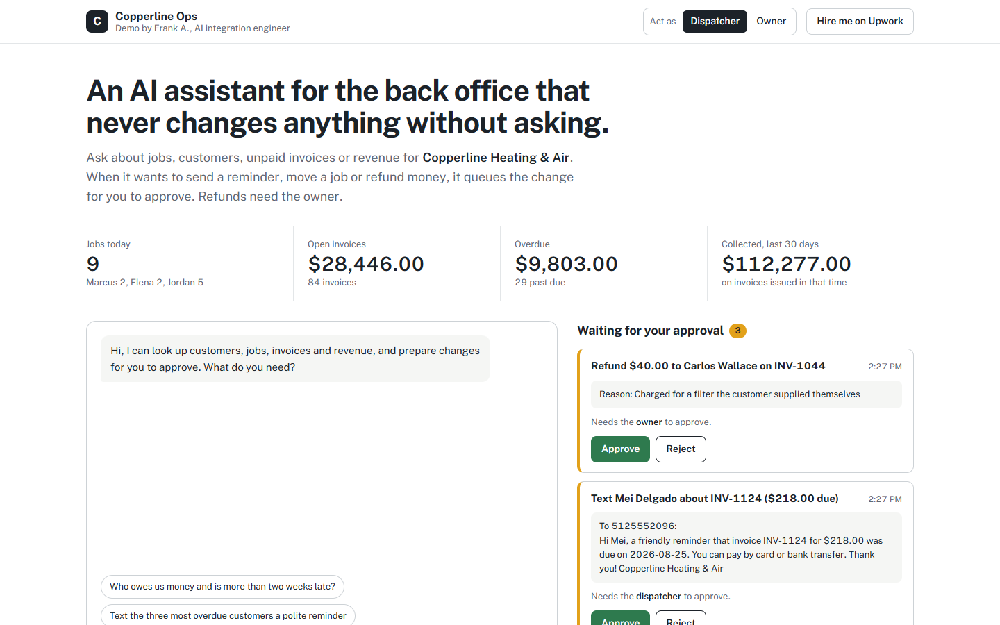

# AI ops assistant with approvals, over MCP

**Live demo:** https://ops.frankonline.cloud
**Public read-only MCP endpoint:** `https://ops.frankonline.cloud/mcp`

A back-office assistant for a (fictional) heating and air company. Staff ask about jobs, customers, unpaid invoices and revenue; when the assistant wants to change something (send a payment reminder, move a job, draft an invoice, issue a refund) it queues the change as an approval card. Nothing happens until a person approves it, and refunds need the owner.



## Architecture

```
browser ── /api/chat ──► agent.mjs (Claude, tool loop)
                              │  tools discovered via MCP
                              ▼
                         MCP client ──in-process──► mcp-server.mjs (business tools)
                              │                         readOnlyHint: true  → run now
                              │                         readOnlyHint: false → approvals.mjs
                              ▼
                         approvals.mjs: pending action → role check → MCP callTool → audit log

public  ── POST /mcp ──► the same MCP server, read-only tools only (Streamable HTTP, stateless)
```

- **Tools live in an MCP server.** The agent discovers them at startup, so a new tool needs no agent code. The same server, with write tools left out, is exposed publicly so anyone can connect Claude to it.
- **The host enforces approval.** The MCP server marks tools that change data. The host turns every such call into a pending action; the model can't skip it and is told nothing is done until approved. Decisions are fed back into the next turn.
- **Roles.** Reminders, reschedules and invoice drafts need the dispatcher; refunds need the owner. Approving runs exactly once (the action is claimed before the call), and only the session that requested it can decide.
- **The server double-checks.** Zod schemas validate every input, and business rules are enforced in the tool: refunds can't exceed what was paid, reschedules can't clash with the technician's other jobs or fall outside opening hours.
- **Audit trail.** Every proposal, approval, refusal and blocked attempt is logged with who did it.
- **Spend protection.** Proof-of-work before a session, message and session caps, a daily AI call and dollar budget, and an `AI_ENABLED` kill switch.

## Connect your own Claude

```bash
claude mcp add --transport http copperline-ops https://ops.frankonline.cloud/mcp
```

Or probe it: `node scripts/probe-mcp.mjs https://ops.frankonline.cloud/mcp`

## Run it

```bash
npm install
cp .env.example .env   # add ANTHROPIC_API_KEY
node --env-file=.env server.mjs   # http://localhost:5200
npm test                         # MCP discovery, approvals, roles, validation
```

Stack: Node 24, Express 5, `@modelcontextprotocol/sdk`, Zod, Anthropic SDK, built-in `node:sqlite`, Luxon, plain HTML/CSS/JS, Docker + Caddy. Demo data is generated relative to today and rebuilt daily.

## Adapting it for a real business

Replace `mcp-server.mjs` tools with the client's systems (ServiceM8, Jobber, HubSpot, GoHighLevel, QuickBooks, Stripe), keep the approval policy in `approvals.mjs`, and put the assistant where the team already works (Slack, Teams, WhatsApp).

Built by [Frank A.](https://www.upwork.com/freelancers/~0170dd39761ac49004), AI integration engineer.
